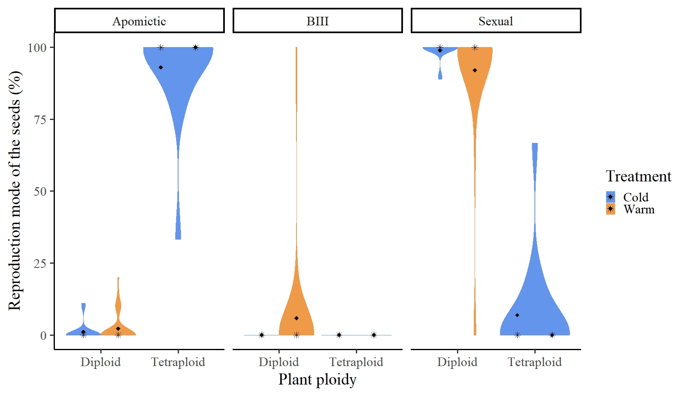
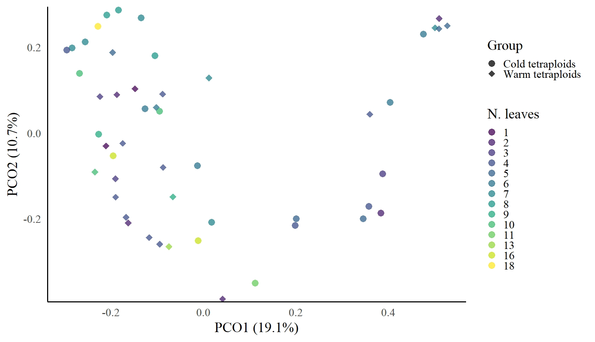
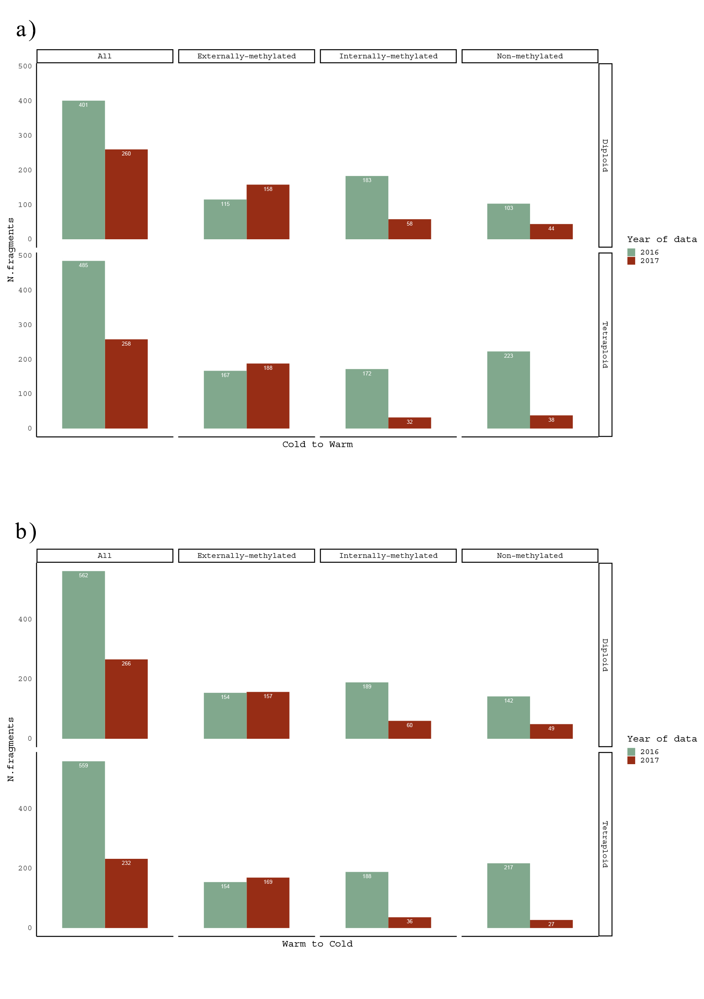

# Data visualisation projects

## Gapminder project

**Seaborn notebook**


**Plotly notebook**


<div align="justify">The current project visualizes, as an animated scatterplot, the correlation of countries' fertility rate with life expactancy and population between 1960 and 2015. The size of the scatters represents the population of each country, the colours shows in which continent they can be found. There are two notebooks on the project, one using seaborn and the other plotly, as visualisation libraries.</div><br>

Data source: [Gapminder Foundation](https://www.gapminder.org/data/).<br>

## Bio-Themed Visuals in R for the vegetative growth and reproductive mode of the plant species *Ranunculus kuepferi*

Collection of bio-themed data visuals produced in the course of a doctorate study &nbsp; `by Eleni Syngelaki`
External links to the scientific publications: [1](https://www.uni-goettingen.de/de/document/download/5f83b632096157bccb9f3bd50b3f9ec8.pdf/Syngelaki%20et%20al_2020.pdf), [2](https://www.uni-goettingen.de/de/document/download/918cf0991ddee7b1afc6531841d1b8fb.pdf/Syngelaki_etal_2020_biology-09-00315.pdf)
<br>

### (1) Violin Plot
A box plot and kernel density plot hybrid that shows summary statistics as well as the full distribution of the data.

<p align="left">
  
</p>


Below is a sample code that can be used to generate violin plots in __R__:

```r
# load the appropriate packages
library(ggplot2)

# generate plots
.df <- data.frame(x = all$ploidy, y = all$percentage, z = all$treatment, v = all$rep_mode)


.plot <- ggplot(data = .df, aes(x = factor(x), y = y, colour = z, fill = z)) + geom_violin(scale = "width", position = position_dodge(width = 0.9), trim = TRUE)  + stat_summary(fun.y = mean, geom = "point", position = position_dodge(width = 0.9), shape = 18, size = 3.5, colour = "black") + stat_summary(fun.y = median, geom = "point",position = position_dodge(width = 0.9), shape = 8, size = 3.5, colour = "black") + scale_colour_manual(values=c("cornflowerblue","tan2")) + scale_fill_manual(values=c("cornflowerblue","tan2")) + facet_grid(. ~ v) + xlab("Plant ploidy") + ylab("Reproduction mode of the seeds (%)") + labs(fill = "Treatment", colour = "Treatment") + theme_classic(base_size = 26, base_family = "serif") + theme(legend.position = "right")

print(.plot)
rm(.df, .plot)
```
### (2) PCoA Plot
Principal Coordinates Analysis (PCoA) is a statistical method that converts data on distances between items into map-based visualization of those items.

The generated mappings can be used for better understanding which items are close to each other, and which are different. It can also allow you to identify groups or clusters.

<p align="left">
  
</p>


Below is a sample code that can be used to generate PCoA plots in __R__:

```r
# load the appropriate packages
library(ggplot2)

# generate plots
.df <- data.frame(x = l_tetra$PCO1.19.1.., y = l_tetra$PCO2.10.7.., z = l_tetra$LeafgroupID, s = l_tetra$Group)

.plot <- ggplot(data = .df, aes(x = x, y = y, shape = s, colour = z)) + 
geom_point(size = 6.5, alpha = 0.75) + 
scale_color_viridis(discrete = TRUE, option = "D", labels = c("1", "2", "3", "4", "5", "6", "7", "8", "9", "10", "11", "13", "16", "18")) + scale_shape_manual(labels = c("Cold tetraploids", "Warm tetraploids"), values=c(16, 18)) 
+ scale_y_continuous(expand = c(0.01, 0)) + xlab("PCO1 (19.1%)") + ylab("PCO2 (10.7%)") + labs(shape = "Group", colour = "N. leaves")+ theme_classic(base_size = 26, base_family = "serif") + theme(legend.position = "right", axis.ticks = element_blank())

print(.plot)
rm(.df, .plot)
```
### (3) Bar Plot
A barplot is used to display the relationship between a numeric and a categorical variable.

<p align="left">
  
</p>


Below is a sample code that can be used to generate bar plots in __R__:

```r
# load the appropriate packages
library(ggplot2)

# generate plots

#(a)  Warm_to_Cold

.df <- data.frame(x = barplot$ID_2, y = barplot$Markers, w = barplot$Markers, v = barplot$Epiloci, u = barplot$Ploidy, z = barplot$ID_year)
.plot <- ggplot(data = .df, aes(x = factor(x), y = y, fill = z)) + geom_bar(stat = "identity", position = position_dodge(), width = 0.75) + geom_text( aes(label= w), position = position_dodge(width = 0.75), vjust = 1.6, color = "white", size = 3.75) + facet_grid(u ~ v) + scale_fill_manual(labels = c("2016", "2017"), values= wes_palette("Cavalcanti1")[4:5]) + xlab("Warm to Cold") + ylab("N.fragments") + labs(fill = "Year of data") + labs(title = "Barplots of scorable fragments (Warm to Cold) ") + theme_classic(base_size = 20, base_family = "mono") + theme(legend.position = "right", axis.ticks = element_blank(), axis.text.x = element_blank())

print(.plot)
rm(.df, .plot)

#(b) Cold_to_Warm

.df <- data.frame(x = barplota$ID_2, y = barplota$Markers, w = barplota$Markers, v = barplota$Epiloci, u = barplota$Ploidy, z = barplota$ID_year)
.plot <- ggplot(data = .df, aes(x = factor(x), y = y, fill = z)) + geom_bar(stat = "identity", position = position_dodge(), width = 0.75) + geom_text( aes(label= w), position = position_dodge(width = 0.75), vjust = 1.6, color = "white", size = 3.75) + facet_grid(u ~ v) + scale_fill_manual(labels = c("2016", "2017"), values= wes_palette("Cavalcanti1")[4:5]) + xlab("Cold to Warm") + ylab("N.fragments") + labs(fill = "Year of data") + labs(title = "Barplots of scorable fragments (Cold to Warm)") + theme_classic(base_size = 20, base_family = "mono") + theme(legend.position = "right", axis.ticks = element_blank(), axis.text.x = element_blank())

print(.plot)
rm(.df, .plot)
```
